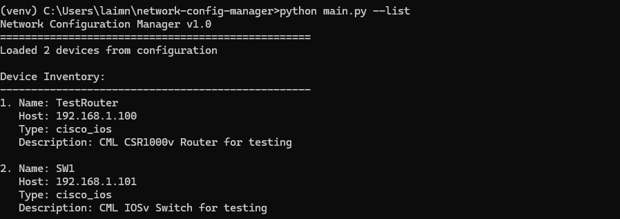

\# Network Configuration Manager 


A Python-based tool for automating network device configuration management, backup, and monitoring. Tested using my PC and Cisco Modeling Labs


\## Features


\- \*\*Device Connection Testing\*\* - Verify SSH connectivity to network devices

\- \*\*Configuration Backup\*\* - Automated backup of device configurations with timestamping

\- \*\*Device Inventory Management\*\* - YAML-based device inventory system

\- \*\*Flexible Operations\*\* - Support for single device or bulk operations

\- \*\*Multiple Device Types\*\* - Support for Cisco IOS, Juniper, Arista, and more


\## Project Structure


network-config-manager/

├── src/

│   ├── init.py

│   ├── device\_connector.py    # Device connection handling

│   ├── config\_reader.py       # YAML configuration management

│   └── backup\_handler.py      # Configuration backup operations

├── configs/

│   ├── devices.yaml          # Device inventory

│   └── templates/            # Configuration templates

├── backups/                  # Stored configuration backups

├── logs/                     # Application logs

├── main.py                   # Main application entry point

├── requirements.txt          # Python dependencies

└── README.md                # This file


\## Installation


1\. \*\*Clone or download the project\*\*

2\. \*\*Create virtual environment:\*\*


## Screenshots and Examples

### Device Connectivity Testing


### Device Inventory


### Configuration Backup Process


### Generated Backup Files


### CML Topology


```bash

&nbsp;  python -m venv venv

&nbsp;  venv\\Scripts\\activate  # Windows

&nbsp;  source venv/bin/activate  # Linux/Mac


\## Install dependencies:


pip install -r requirements.txt


\## Configuration

\# Edit configs/devices.yaml to add your network devices:


devices:

&nbsp; - name: "my-switch"

&nbsp;   host: "192.168.1.10"

&nbsp;   device\_type: "cisco\_ios"

&nbsp;   username: "admin"

&nbsp;   description: "Main distribution switch"


\## Usage

\# List Devices


python main.py --list


\## Test Device Connectivity


\# Test specific device

python main.py --test --device my-switch


\# See available devices

python main.py --test


\## Backup Configurations

\# Backup specific device


python main.py --backup --device my-switch


\# Backup all devices

python main.py --backup --all


\# See backup options

python main.py --backup


\## Get Help

python main.py --help


\## Supported Device Types


\# cisco\_ios

\# cisco\_xe

\# juniper

\# arista\_eos

\# hp\_comware

\# And more via Netmiko library


\## Security Notes


\# Store credentials securely (not in YAML files)

\# Use SSH keys when possible

\# Implement proper access controls

\# Consider encrypted credential storage


\## Future Enhancements


\# Configuration deployment from templates

\# Configuration comparison and diff

\# Rollback functionality

\# Web-based dashboard

\# Scheduled backup jobs

\# Email notifications

\# Database integration


\## Dependencies


\# netmiko - SSH connections to network devices

\# PyYAML - YAML configuration file parsing

\# rich - Enhanced terminal output


\## License

\# This project is for educational and portfolio purposes.

\## Author

\# Created as a network engineering portfolio project demonstrating my Python automation skills.


\*\*Then:\*\*

1\. Press `Ctrl+S` to save

2\. Close Notepad


\## Step 18: Final Testing


Let's do a comprehensive test of all features:


\*\*Type this command and press Enter:\*\*

```bash

python main.py --help


\## Type this command and press Enter:

python main.py --list


## 📖 Complete Setup Guide

For detailed step-by-step instructions, see our comprehensive [Installation Guide](INSTALLATION_GUIDE.md) which includes:

- Complete development environment setup
- Testing environment configuration (CML/DevNet)
- GitHub integration workflow
- Troubleshooting common issues
- Advanced configuration options

**Download the guide:** [INSTALLATION_GUIDE.md](INSTALLATION_GUIDE.md)